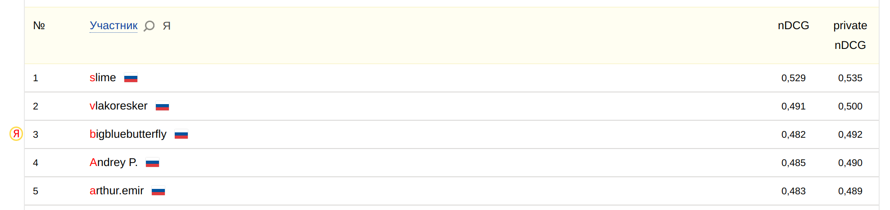

# yandex-cup-2022-ML-Audio-3rd

_______
`single_train.ipynb` - train single model (stage 1 - ArcFace+curriculum, stage 2 - SmoothAP for best stage 1 model), validate with as-norm, create test submission. 2-staged training hits 0.53-0.55 validation nDCG (depending on fold) and ~0.455 on public.

`ensemble.ipynb` - ensemble (K-fold) inference with as-norm, yields 0.482 public and 0.492 private nDCG for 10 best models. 

Code was used for Yandex DataSphere and batch_size is optimized for V100 GPU, most likely it used `1.9.1+cu111` torch version. **DataSphere actually had issues with seed fixing, so results may be slightly different**. 

Some of the codes aren't actually mine - [ArcFace & n-per-speaker sampler](https://github.com/clovaai/voxceleb_trainer), [SmoothAP](https://github.com/Andrew-Brown1/Smooth_AP), [RMSNorm](https://github.com/bzhangGo/rmsnorm), [RoPE](https://blog.eleuther.ai/rotary-embeddings/). 

